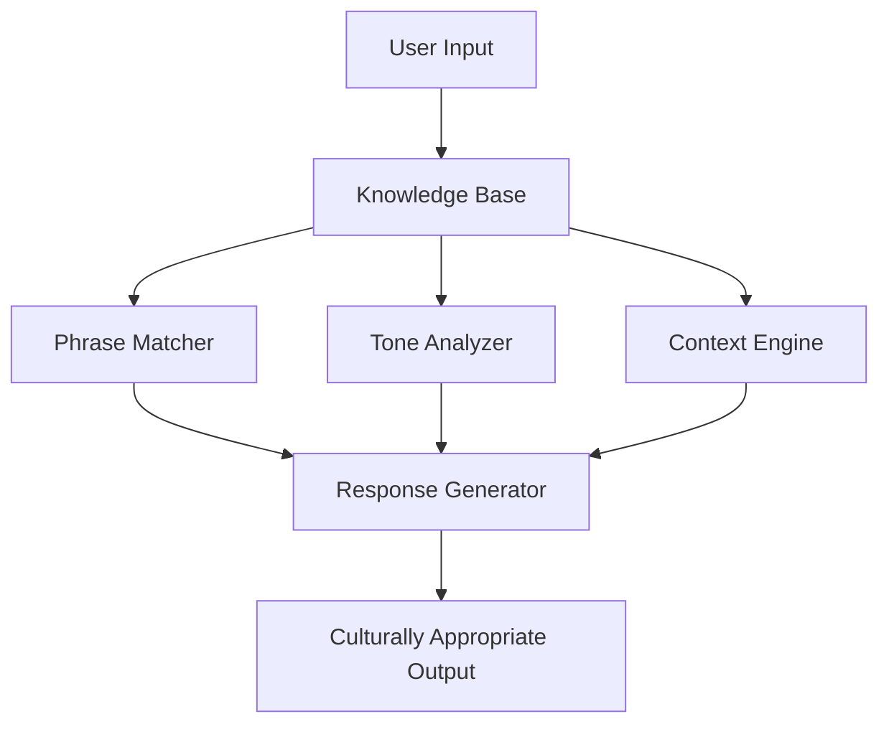

# Design Document: Lucknow Local Tehzeeb & Slang Interpreter

## Overview

The Lucknow Local Tehzeeb & Slang Interpreter is a knowledge-driven AI system that demonstrates behavioral intelligence through structured cultural context encoding. The system transforms generic AI responses into culturally nuanced, contextually appropriate outputs by leveraging a comprehensive knowledge base of Lucknow's linguistic patterns, social etiquette, and indirect communication norms.

The core innovation is the structured encoding of cultural intelligence in `.kiro/product.md`, which serves as the authoritative source for phrase interpretations, tone analysis rules, behavioral guidelines, and contextual reasoning patterns. This approach proves that AI behavior can be meaningfully steered through well-structured local knowledge rather than generic training data.

## Architecture

The system follows a knowledge-driven architecture with four primary components:



**Knowledge Base** (`.kiro/product.md`): Central repository containing structured cultural knowledge including phrase mappings, behavioral rules, tone classification guidelines, and contextual interpretation patterns.

**Phrase Matcher**: Identifies input phrases in the knowledge base and retrieves complete entry information including literal meaning, implied meaning, tone category, usage context, social appropriateness, risks, and example usage.

**Tone Analyzer**: Classifies emotional and social tone using knowledge base rules, distinguishing between surface-level and culturally-implied tones across five categories: polite, casual, sarcastic, respectful, teasing.

**Context Engine**: Infers implied meanings by applying cultural context rules, identifying indirect speech patterns, respect-based interpretations, and situational meaning shifts.

**Response Generator**: Produces culturally appropriate responses following tehzeeb speech patterns, incorporating respect markers, avoiding bluntness, and adapting to social context (elder interactions, formal settings, casual conversations).

## Components and Interfaces

### Knowledge Base Structure

The knowledge base in `.kiro/product.md` is organized into distinct sections:

**1. Phrase Dictionary Section**
- Minimum 25-30 entries
- Each entry follows strict schema:
  - Phrase: The Lucknow expression
  - Literal Meaning: Direct translation
  - Implied Meaning: Cultural interpretation
  - Tone Category: polite | casual | sarcastic | respectful | teasing
  - Usage Context: When and where appropriate
  - Social Appropriateness: Who can use it, with whom
  - Risks / Misinterpretation Notes: Common mistakes
  - Example Conversation Use: Realistic dialogue snippet

**2. Behavioral Rules Section**
- Polite disagreement rules
- Indirect refusal patterns
- Respect markers ("aap", "meharbani", "pehle aap")
- Humor norms and boundaries
- Elder interaction etiquette
- Each rule encoded as explicit reasoning guideline

**3. Local Context Intelligence Section** (Optional)
- Time-based crowd behavior
- Authentic vs tourist spot indicators
- Safety hints with cultural awareness
- Food ordering etiquette

**4. Test Prompts & Expected Behavior Section**
- 10-12 evaluation prompts
- Each prompt shows:
  - Generic AI response (wrong/shallow)
  - Lucknow-aware AI response (nuanced/contextual)
- Demonstrates behavioral shift clearly

### Phrase Matcher Interface

```
Input: user_text (string)
Output: {
  matched_phrases: [
    {
      phrase: string,
      literal_meaning: string,
      implied_meaning: string,
      tone_category: string,
      usage_context: string,
      social_appropriateness: string,
      risks: string,
      example_use: string
    }
  ],
  exact_match: boolean,
  partial_matches: []
}
```

### Tone Analyzer Interface

```
Input: phrase (string), context (object)
Output: {
  primary_tone: string,  // polite | casual | sarcastic | respectful | teasing
  tone_explanation: string,
  alternative_tones: [
    {
      tone: string,
      context_condition: string
    }
  ],
  cultural_factors: [string]
}
```

### Context Engine Interface

```
Input: phrase (string), speaker_context (object), listener_context (object)
Output: {
  literal_interpretation: string,
  implied_interpretation: string,
  context_factors: [string],
  indirect_pattern_type: string,  // refusal | disagreement | request | compliment
  respect_level: string,  // casual | formal | highly_formal
  interpretation_confidence: number
}
```

### Response Generator Interface

```
Input: user_query (string), matched_knowledge (object), tone_analysis (object), context_analysis (object)
Output: {
  response_text: string,
  response_tone: string,
  respect_markers_used: [string],
  cultural_adaptations: [string],
  alternative_responses: [
    {
      response: string,
      context: string
    }
  ]
}
```

## Data Models

### Phrase Entry Model

```
{
  phrase: string (required),
  literal_meaning: string (required),
  implied_meaning: string (required),
  tone_category: enum ["polite", "casual", "sarcastic", "respectful", "teasing"] (required),
  usage_context: string (required),
  social_appropriateness: string (required),
  risks_notes: string (required),
  example_conversation: string (required),
  tags: [string] (optional),
  related_phrases: [string] (optional)
}
```

### Behavioral Rule Model

```
{
  rule_name: string (required),
  rule_type: enum ["disagreement", "refusal", "respect_marker", "humor", "elder_interaction"] (required),
  description: string (required),
  application_context: string (required),
  examples: [
    {
      situation: string,
      correct_behavior: string,
      incorrect_behavior: string
    }
  ] (required),
  exceptions: [string] (optional)
}
```

### Context Model

```
{
  speaker: {
    age_group: enum ["young", "middle", "elder"],
    relationship: enum ["stranger", "acquaintance", "friend", "family", "elder"],
    formality_level: enum ["casual", "formal", "highly_formal"]
  },
  listener: {
    age_group: enum ["young", "middle", "elder"],
    relationship: enum ["stranger", "acquaintance", "friend", "family", "elder"],
    formality_level: enum ["casual", "formal", "highly_formal"]
  },
  setting: enum ["public", "private", "professional", "social"],
  time_sensitivity: boolean
}
```

### Evaluation Prompt Model

```
{
  prompt_id: string (required),
  prompt_text: string (required),
  generic_ai_response: string (required),
  lucknow_aware_response: string (required),
  demonstrates: [string] (required),  // e.g., ["tone_interpretation", "implied_meaning", "cultural_appropriateness"]
  explanation: string (required)
}
```

## Implementation Strategy

### Phase 1: Knowledge Base Population

1. Create `.kiro/product.md` with structured sections
2. Populate phrase dictionary with 25-30 high-value entries covering:
   - Common greetings and farewells
   - Indirect requests and refusals
   - Polite disagreements
   - Compliments and appreciation
   - Sarcastic/teasing expressions
   - Elder interaction phrases
   - Food and hospitality expressions
3. Encode behavioral rules for each category
4. Add local context intelligence (optional but valuable)
5. Create evaluation section with 10-12 test prompts

### Phase 2: Configuration Files

1. Populate `.kiro/prompts.json` with 6-8 evaluation prompts in JSON format
2. Populate `.kiro/tasks.json` with:
   - `run-local-guide`: Task to demonstrate interpreter functionality
   - `evaluate-local-context`: Task to run evaluation prompts and compare outputs

### Phase 3: Integration

The knowledge base serves as the authoritative source that steers AI behavior. When the AI processes user input:

1. AI reads and parses `.kiro/product.md` structure
2. AI matches user input against phrase dictionary
3. AI applies tone analysis rules from behavioral section
4. AI uses context engine rules to infer implied meaning
5. AI generates response following tehzeeb patterns and respect markers
6. AI validates response against social appropriateness guidelines

### Content Guidelines

**Focus Areas:**
- Cultural nuance over facts
- Tone and etiquette over vocabulary
- Indirect meaning over literal translation
- Lived behavior over tourist information
- Social context over generic rules

**Avoid:**
- Tourist fluff and generic city descriptions
- Wikipedia-style historical content
- Surface-level translations without cultural context
- Generic politeness rules not specific to Lucknow
- Overly formal or academic language

### Example Phrase Entries (Illustrative)

**Entry 1: Polite Refusal**
```
Phrase: "Abhi thoda kaam hai"
Literal Meaning: I have some work right now
Implied Meaning: I don't want to do this / I'm politely declining
Tone Category: polite
Usage Context: When declining invitation or request without directly saying no
Social Appropriateness: Safe to use with anyone; maintains relationship harmony
Risks / Misinterpretation Notes: May be taken literally by non-locals; could lead to repeated requests
Example Conversation Use: 
  Friend: "Chalo, chai peete hain"
  You: "Abhi thoda kaam hai, phir kabhi"
  (Translation: Let's have tea / I have some work now, maybe later)
```

**Entry 2: Respectful Address**
```
Phrase: "Pehle aap"
Literal Meaning: You first
Implied Meaning: Showing respect and deference; offering precedence
Tone Category: respectful
Usage Context: When entering doorways, serving food, or any situation requiring courtesy
Social Appropriateness: Essential with elders, guests, or in formal settings
Risks / Misinterpretation Notes: Omitting this can be seen as rude or disrespectful
Example Conversation Use:
  At doorway with elder
  Elder: "Chalo andar"
  You: "Pehle aap"
  (Translation: Let's go inside / You first)
```


## Correctness Properties

A property is a characteristic or behavior that should hold true across all valid executions of a system—essentially, a formal statement about what the system should do. Properties serve as the bridge between human-readable specifications and machine-verifiable correctness guarantees.

### Property 1: Complete Phrase Entry Retrieval

*For any* phrase that exists in the knowledge base, when the Interpreter retrieves it, the output should contain all required schema fields: phrase, literal meaning, implied meaning, tone category, usage context, social appropriateness, risks/misinterpretation notes, and example conversation use.

**Validates: Requirements 1.1, 1.4, 1.5**

### Property 2: Multiple Context Handling

*For any* phrase with multiple contextual meanings in the knowledge base, when the Interpreter processes it, the output should include all relevant interpretations with their corresponding usage contexts.

**Validates: Requirements 1.2**

### Property 3: Valid Tone Classification

*For any* phrase analyzed by the Tone Analyzer, the output should classify it into exactly one of the five valid categories (polite, casual, sarcastic, respectful, teasing) and include a cultural explanation for why that tone applies.

**Validates: Requirements 2.1, 2.2**

### Property 4: Context-Specific Tone Mapping

*For any* phrase with multiple possible tones, when the Tone Analyzer processes it, the output should indicate which tone applies in which social context.

**Validates: Requirements 2.3**

### Property 5: Dual Tone Recognition

*For any* phrase where surface-level tone differs from culturally-implied tone, the Tone Analyzer should identify and distinguish both tones.

**Validates: Requirements 2.4**

### Property 6: Meaning Divergence Explanation

*For any* phrase where literal meaning differs from implied meaning, the Context Engine should identify both meanings and explain the contextual factors that create the divergence.

**Validates: Requirements 3.1, 3.2**

### Property 7: Indirect Pattern Recognition

*For any* phrase tagged as an indirect refusal or polite disagreement in the knowledge base, the Context Engine should correctly identify the pattern type.

**Validates: Requirements 3.3**

### Property 8: Context-Dependent Interpretation

*For any* phrase analyzed with elder context versus non-elder context, the Context Engine should apply different interpretation rules, resulting in different respect levels or interpretations.

**Validates: Requirements 3.4**

### Property 9: Tehzeeb Pattern Compliance

*For any* response generated by the Response Generator, the output should follow Lucknow tehzeeb speech patterns as defined in the knowledge base behavioral rules.

**Validates: Requirements 4.1**

### Property 10: Indirect Response Generation

*For any* scenario where direct response would be culturally inappropriate (as defined by knowledge base rules), the Response Generator should produce an indirect alternative response.

**Validates: Requirements 4.2**

### Property 11: Appropriate Politeness Levels

*For any* response generated in formal or elder contexts, the Response Generator should incorporate appropriate respect markers ("aap", "meharbani", "pehle aap"), apply elevated politeness rules, and avoid rude or blunt language.

**Validates: Requirements 4.3, 4.4, 4.5**

### Property 12: Schema Compliance

*For any* entry in the knowledge base (phrase entries or behavioral rules), the entry should conform to its respective schema format with all required fields present and properly structured.

**Validates: Requirements 6.1, 6.2**

### Property 13: Evaluation Format Completeness

*For any* evaluation prompt in the "Test Prompts & Expected Localized Behavior" section, the entry should include both a generic AI response (demonstrating wrong/shallow behavior) and a Lucknow-aware response (demonstrating nuanced/contextual behavior) with clear behavioral differences.

**Validates: Requirements 8.3, 8.4**

## Error Handling

### Knowledge Base Errors

**Missing Phrase**: When a user inputs a phrase not in the knowledge base, the system should:
- Return a clear message indicating the phrase is not recognized
- Suggest similar phrases if partial matches exist
- Offer to explain general Lucknow communication patterns

**Malformed Entry**: When a knowledge base entry is missing required fields:
- Log the error with entry identifier
- Skip the malformed entry
- Continue processing with valid entries
- Report malformed entries in system diagnostics

**Invalid Tone Category**: When an entry contains a tone category outside the five valid options:
- Log the error with entry identifier
- Default to "casual" tone
- Flag the entry for review

### Context Analysis Errors

**Insufficient Context**: When context information is incomplete for accurate interpretation:
- Use default context assumptions (casual, peer-to-peer)
- Indicate confidence level in interpretation
- Suggest what additional context would improve accuracy

**Ambiguous Pattern**: When multiple indirect patterns could apply:
- Return all possible interpretations ranked by likelihood
- Explain contextual factors that would disambiguate
- Provide examples of each interpretation

### Response Generation Errors

**Conflicting Rules**: When multiple behavioral rules conflict:
- Prioritize respect and politeness over directness
- Default to more formal/polite option
- Log the conflict for knowledge base refinement

**No Appropriate Response**: When no culturally appropriate response can be generated:
- Explain why the situation is culturally complex
- Provide multiple options with trade-offs
- Suggest consulting a local cultural expert

## Testing Strategy

### Dual Testing Approach

The system will use both unit testing and property-based testing to ensure comprehensive coverage:

**Unit Tests** focus on:
- Specific example phrases and their expected outputs
- Edge cases (empty input, malformed entries, missing fields)
- Integration between components (phrase matcher → tone analyzer → response generator)
- Specific behavioral rules (elder interaction, indirect refusals)

**Property-Based Tests** focus on:
- Universal properties that hold across all phrases in the knowledge base
- Schema compliance across all entries
- Tone classification validity across all phrases
- Response appropriateness across all contexts

Together, unit tests catch concrete bugs in specific scenarios, while property tests verify general correctness across the entire input space.

### Property-Based Testing Configuration

**Testing Library**: We will use `fast-check` for JavaScript/TypeScript implementation, as it provides excellent support for custom generators and property-based testing patterns.

**Test Configuration**:
- Minimum 100 iterations per property test
- Each property test references its design document property
- Tag format: `// Feature: lucknow-local-interpreter, Property {number}: {property_text}`

**Example Property Test Structure**:

```typescript
// Feature: lucknow-local-interpreter, Property 1: Complete Phrase Entry Retrieval
test('all retrieved phrases contain complete schema fields', () => {
  fc.assert(
    fc.property(
      fc.constantFrom(...knowledgeBase.phrases),
      (phrase) => {
        const result = interpreter.retrievePhrase(phrase.phrase);
        expect(result).toHaveProperty('phrase');
        expect(result).toHaveProperty('literal_meaning');
        expect(result).toHaveProperty('implied_meaning');
        expect(result).toHaveProperty('tone_category');
        expect(result).toHaveProperty('usage_context');
        expect(result).toHaveProperty('social_appropriateness');
        expect(result).toHaveProperty('risks_notes');
        expect(result).toHaveProperty('example_conversation');
      }
    ),
    { numRuns: 100 }
  );
});
```

### Test Coverage Goals

**Knowledge Base Validation**:
- All 25+ phrase entries have complete schema fields
- All behavioral rules are properly structured
- Evaluation section has 10+ prompts with before/after comparisons

**Component Testing**:
- Phrase Matcher: 100% coverage of matching logic, partial matches, no matches
- Tone Analyzer: All five tone categories tested, multi-tone scenarios, cultural vs surface tone
- Context Engine: Elder vs non-elder contexts, indirect patterns, meaning divergence
- Response Generator: Tehzeeb patterns, respect markers, politeness levels, indirectness

**Integration Testing**:
- End-to-end flow from user input to culturally appropriate response
- Cross-component data flow (matched phrase → tone analysis → context inference → response)
- Error propagation and handling across components

### Evaluation Methodology

**Hackathon Demonstration**:
1. Run evaluation prompts from `.kiro/prompts.json`
2. Compare generic AI responses vs Lucknow-aware responses
3. Measure behavioral differences across dimensions:
   - Tone interpretation accuracy
   - Implied meaning recognition
   - Cultural appropriateness
   - Respect marker usage
   - Indirectness when appropriate

**Success Metrics**:
- 100% of evaluation prompts show clear behavioral improvement
- Lucknow-aware responses demonstrate cultural nuance in all cases
- Generic responses identified as wrong/shallow in all comparative scenarios
- Judges can clearly see the impact of structured knowledge encoding
